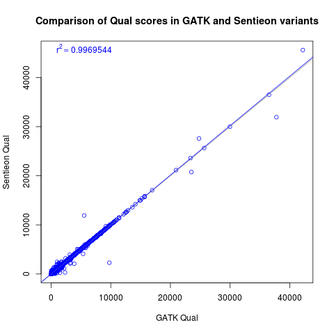

# VCF diff

Ways of comparing VCF files produced by two different methods.

# Usage

## 1. Join VCF fields from two different tools with call_joiner.pl

Join VCFs genotype fields produced by two different methods into one file. Either vcf or gzipped vcf may be used.
```
perl call_joiner.pl --gatk sample.gatk.vcf --sentieon sample.sentieon.vcf > sample.combined.vcf
```

This produces a file that looks like this and can be read into R.

```
Coord   Sentieon        GATK    Type
chr10:100004906 0       0       AD1
chr10:100004906 3       3       AD2
chr10:100004906 3       3       DP
chr10:100004906 9       9       GQ
chr10:100004906 1       1       GT1
chr10:100004906 1       1       GT2
chr10:100004906 109     106     PL1
chr10:100004906 9       9       PL2
chr10:100004906 0       0       PL3
chr10:100004906 81.28   78.28   Qual
```

The different format codes may or may not have a number after it, which indicates the token position in the original string, starting with 1. (e.g. AD="0,3" -> AD1=0, AD2=3).


## 2. Plot all the things with R

For each 'Type' in from the file above, plot a correlation of GATK v. Sentieon. The script is intended to combine the results from multiple joinings.

```
Rscript Sentieon.R sample1.joined sample2.joined sample3.joined
```

And produces lovely graphs like these:



